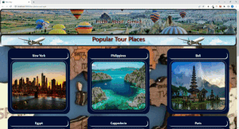

<p align="left">
<a href="https://www.linkedin.com/in/ozkankomu/" target="_blank"></a>
</p>


# Project : Tour Places
## Table of contents

  - [The challenge](#the-challenge)
  - [Screenshot](#screenshot)
  - [Project Skeleton ](#project-skeleton)
  - [Links](#links)
  - [Built with](#built-with)
  - [Useful resources](#useful-resources)
- [Author](#author)


## The challenge
Example of a one-page get-to-know project for a tour company. In the project, data was drawn from the data.jsx file and processed with react using the components method and shaped with css.
## Project Skeleton 

```

001-Tour Project(folder)
|
|----readme.md         
SOLUTION
├── public
│     └── index.html
├── src
│    ├── components
│    │       ├── cards
│    │       │     ├── Card.css
│    │       │     └── Card.js
│    │       ├── header
│    │       │     ├── Header.css
│    │       │     └── Header.js
│    │       └── navbar
│    │             ├── Navbar.css
│    │             └── Navbar.js
│    ├── helper
│    │       └── data.js
│    ├── App.js
│    ├── App.css
│    ├── index.js
│    └── index.css
├── package.json
└── yarn.lock
```

## Screenshot
<p align="left">
<a href="https://ozkankomu.github.io/tour-places-react-app/"></a>
</p>


## Links
<hr>
<b>Check The Live Website ➡️</b> <a href="https://ozkankomu.github.io/tour-places-react-app/" target="_blank">Live Website</a>
<hr>

### Built with
- js DOM Manipulation
- Semantic HTML5 markup
- CSS custom properties
- Flexbox
- CSS Grid
- Mobile-first workflow
- JS DOM Manipulation	
- ReactJs


## Notes

- I used HTML, CSS , JavaScript/React to complete this project.

### Useful resources

- [W3 Schoold](https://www.w3schools.com/) - This helped me for basics of website paradigm. I really liked this pattern and will use it going forward.
- [MDN](https://developer.mozilla.org/en-US/) - This is an amazing document which helped me finally understand deep sides of web development. I'd recommend it to anyone still learning these concepts.


## Author

- Author - [_Ozkan_]

<center> &#8987; Happy Coding...  &#9997; </center>
